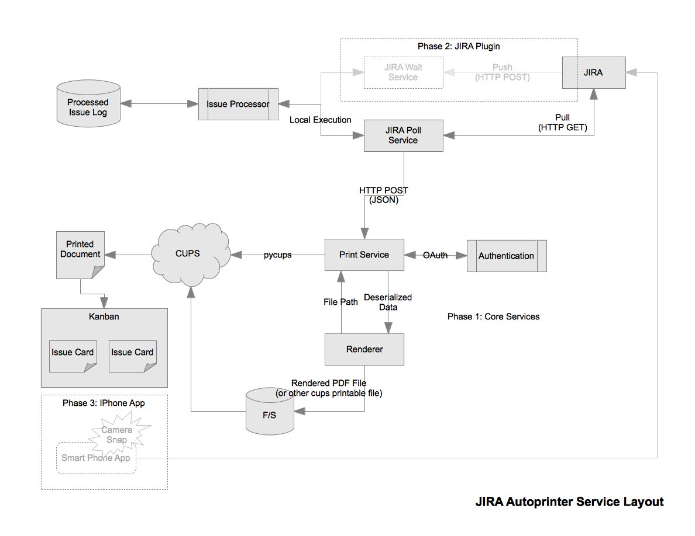

===================================
Automatic Printing Service For JIRA
===================================

:author: Josh Johnson <lionface.lemonface@gmail.com>
:date: April 2012

Overview
========
When working in an Agile context, there is a subdued focus on tooling. Tools help us manage our processes, but they also get in our way.

When we talk about tools here, we're talking about mechanisms for tracking and planning our projects. Specifically, our 'Agile Board' (Kanban) and our interactive tracking software, like JIRA.

This project aims, primarily, to streamline the process by which we interact with our physical tools and reconcile it with our virtual ones.

Secondarily, this project hopes to produce a flexible framework by which developers, as need arises, can create new and interesting bridges between any physical tool and any software. 

Background and Requirements
===========================
My current position is somewhat novel at the time of writing - I work in *DevOps*. We don't call it that, but the people I work with are charged with building up infrastructure to help developers be better engineers and improve overall quality of the software they produce. We're shaping a culture where developers participate in operations. DevOps 101.

In our role, we have a duality of purpose. On one hand, we are an operations group who field service requests on a daily basis. On the other, we're an engineering team who takes on long-term software and infrastructure projects. 

At work, my team and I use a large magnetic whiteboard to track our work, in the Kanban style. Currently we're still in the process of embracing the core ideology, and working on *kaizen* - continual improvement.

The whiteboard is becoming our information hub - this is a big win for the new approach we've taken - a core concept in TDS and Kanban is 'visible work'. The problem is, that the greater development organization we're a part of, and other groups like Cusotmer Support, have very good business reasons for using a dedicated issue tracking system (JIRA), and few reasons to interact directly with our board. 

This puts us in a predicament. It's probably unique to us, but I have a good feeling we're not alone. The board must reflect reality, our tools must reflect reality - by the transitive property, our tools must reflect our board. Practically speaking, this means manual reconciliation at best. Worst case, the entire project structure fails: neither the board nor JIRA reflect the work we're doing, and it all amounts to a bunch of cumbersome ceremony. 

As one can imagine, reconciliation is a hugely inefficient, error prone process. In the short time since we've adopted the Kanban, keeping JIRA and the board in sync has already cost us a lot of time and hassle. This has reduced our ability to provide a high level of service to our users. 

So what do we do? The clue for me comes from one of the major reasons why we use JIRA in the first place: Customer Support. There's an elegance to pointing a user (or a support tech) at a url where they can, in a structured manner, relay their problem, and then easily track its progress. This adds up to letting the issue management system - JIRA - drive what shows up on our whiteboard.

Since our whiteboard trades in paper - typically post-it notes and index cards held up by magnets - it makes good sense to use that as our method of conveyance.

That's really just a fancy way of saying we need an automatic printing system, and an ability to reconcile printed issues with JIRA.

I took on this project initially on my own time, so the requirements were really up to me. 

Here's what I want this project to do:

#. Provide a simple way to interact with a printer over a web request.
#. Provide a pluggable system for rendering arbitrary data into the printer.
#. Add security so that it's not easy for just anyone to print.
#. Create a way to get issues from JIRA to the printer
#. Do it all in a manner that encourages extension and re-use. 
    
System Overview
===============

Components
==========
Print Service
-------------
Accepts REST requests of JSON payloads, and sends them to a predefined print queue. 

Uses oAuth to allow access to print. Back-end is the CUPS API - makes managing the stream of documents to print simple.

To keep protocol and debugging overhead to a minimum, the system uses a plug-in system to provide installable rendering modules. The JSON payload that the service receives is intentionally simple. There are no expectations of complex types, just an indication of what renderer should be used, and the data it expects.

The rendering module's API is simply a python callable. It accepts a python dictionary of values (de-serialized from the JSON payload), and returns a file path. This file path is expected to be a file that can be sent to CUPS. This will typically be a PDF, but includes anything that the ``lpr`` command can print (plain text, images, and raw postscript). 

JIRA Poll Service
-----------------
On a set interval, makes a request to JIRA for issues to print. This happens via XMLRPC currently.

The service maintains a simple database of issues it's already processed, doing a simple diff of a few key attributes to see if the issue needs to be re-printed.

On a different interval, the service cleans old entries out of the database.

.. note::
   This is a sub-optimal way of printing JIRA issues. A push method would be less error-prone. See `JIRA Wait Service`_ for a solution proposed for a future iteration.

JIRA Plugin
-----------
A custom event handler implemented inside of JIRA to send issues for printing. 

When an issue moves from one state to another, is created, or modified, the plug-in sends a request to print a new card to the `JIRA Wait Service`_ to be processed and passed on to the `Print Service`_.

.. note::
   This is currently planned for a later iteration of the system. It's not known what facilities are available for implementing this inside of JIRA (e.g. scripted events, JIRA plug-ins, etc) 
   
JIRA Wait Service
-----------------
Service that listens for events from JIRA, processes the issue information, and contacts the `Print Service`_ for printing. 

This service would share processing code with the `JIRA Poll Service`_. The idea is that the print service would have a generalized set of stock rendering modules, so there would need to be an adaptation from JIRA data to what a 'generic story card' requires.

iPhone App
----------
The one major issue that this application doesn't address is reconciliation back to JIRA. 

I plan to implement an iPhone app that will use optical means to identify a JIRA issue that was printed out with this system in some manner (bar code, OCR, QR code), and allow a user to quickly set the state of issues 'live' on the kanban without having to sit down in front of a computer. 

.. note::
   This feature is considered a long-term goal, and has not been actively designed and developed - yet. 
