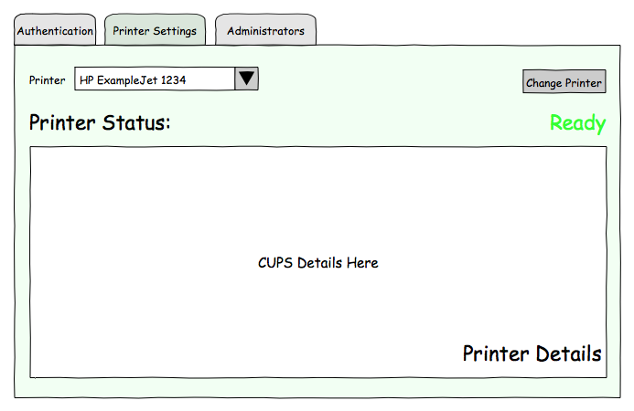
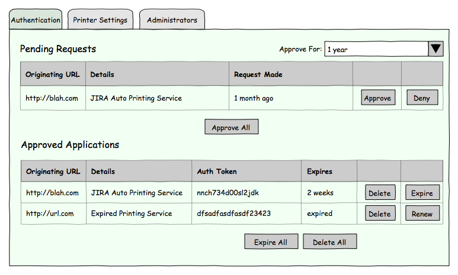
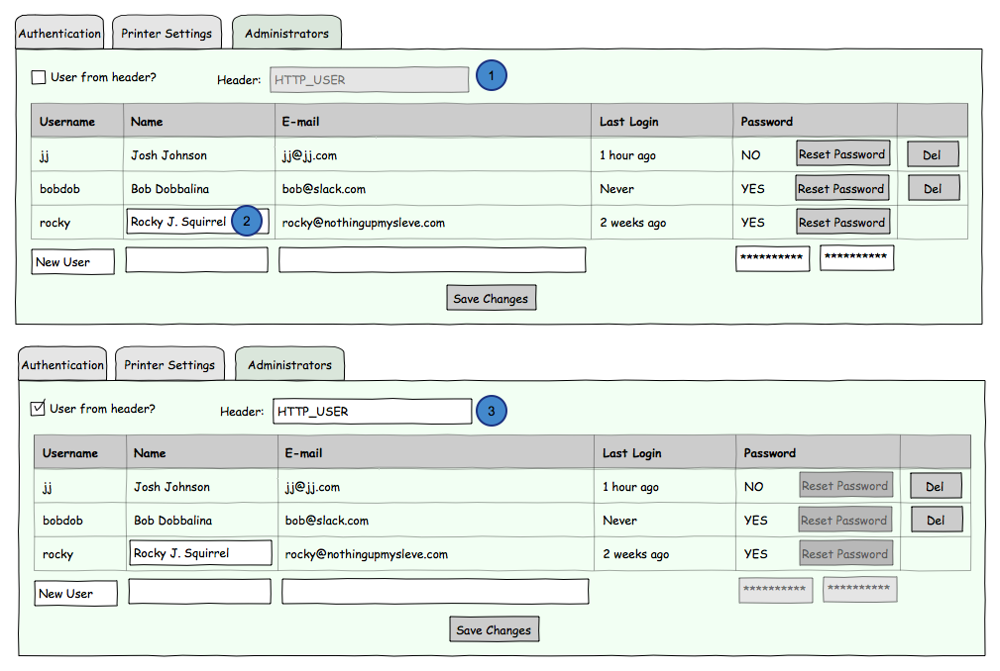
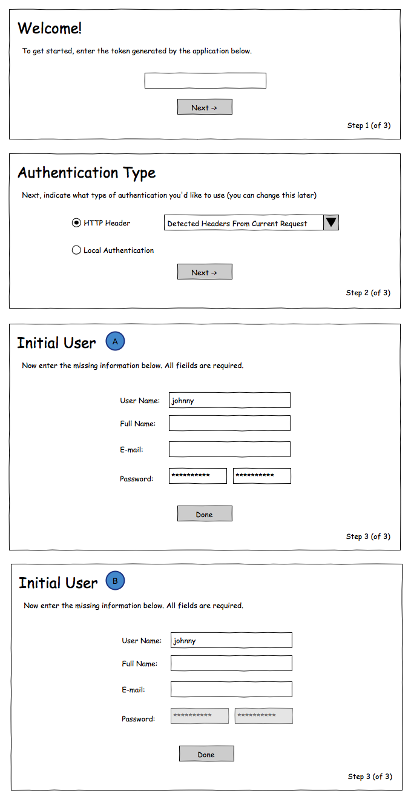

======================
Print Service Features
======================

This document covers the planned features for the Print Service. The form specified is a User Story, followed by use cases as appropriate.

Remote Printing
===============
The core feature of the Print Service is to accept remote printing requests, in a structured way, and pass them on to a print queue. 

Actors
------
Admin:
    A person interacting with the system who has rights to configure the system
User:
    A person interacting with the system who can not configure things.
Consumer:
    A remote service that sends print requests.
Service:
    This service
Renderer:
    A python module that receives a dictionary of information and returns a file path (the intent is that the path represents a printable file that the renderer created)

Use Cases
---------
Configure Authentication
~~~~~~~~~~~~~~~~~~~~~~~~
Admin asks Service to generate an oAuth key for a given Consumer. Admin uses that key to configure that Consumer. The key is stored and used to authenticate future requests from that Consumer. 
    
Print
~~~~~
1. User or Consumer sends a request to the Service indicating what Renderer they want to use, and any expected information the Renderer requires, and an oAuth key as configured in `Configure Authentication`.
2. Service checks the key provided against the one stored.
3. Service invokes Renderer.
4. Service adds file generated by Renderer to the CUPS print queue.
5. Service responds with a successful status code, any output from the Renderer.

Extensions:
    2. a. Authentication fails. Service responds with an error status code (*401 Unauthorized*?).
    
    4. a. The Render fails, throws an exception. Service returns with an error status code (*500 Internal Server Error*?).
       b. The Render completes successfully, but there is an error sending the generated file to CUPS. Service returns with an error status code (*500 Internal Server Error*?). 
    
    5. (a) Renderer does not exist. Service responds with an error status code (*404 Not Found*?), and information notifying the User/Consumer of that fact.
       (b) Renderer does not get necessary information in the request. Service responds with an error status code, and output from the Renderer.

Questions:
    #. **Should there be a UI for users to print without using the REST API?**
       
Query Renderer
~~~~~~~~~~~~~~
1. A User or Consumer sends a request to the Service asking what the expected parameters of a given Renderer are.
2. Service asks Renderer for parameters, and returns to the User/Consumer

Query Service: Renderers
~~~~~~~~~~~~~~~~~~~~~~~~
A User or Consumer sends a request to the Service asking what renderers are available. The Service retrieves information about each available renderer and returns it to the User/Consumer.

Questions:
    #. **Is authorization required to query the service?**

Query Service: Printer Status
~~~~~~~~~~~~~~~~~~~~~~~~~~~~~
A User or Consumer sends a request to the Service asking what the status of the printer and its queue is. 

Query Service: Log Viewing
~~~~~~~~~~~~~~~~~~~~~~~~~~
An Admin logs into the Service and can browse the log.

Manual Printing
~~~~~~~~~~~~~~~
A User takes the place of a Consumer, and logs directly into the application. They are presented with a form where they can choose a renderer, and then fill in the information it requires. Upon validation, the use can either download the printable file, or send it along to the print queue.

Questions:
    #. **How would this work with oAuth?**
    #. **Does this imply users who aren't Admins in the system?**
    
Review Printed Documents
~~~~~~~~~~~~~~~~~~~~~~~~
An Admin logs into the system. They review documents that have been printed previously, for general quality control or debugging purposes.

The Admin is able to view the file names, size, date printed, if there were any errors reported from CUPS, and what User or Consumer printed it.

The Admin is also able to click on one of the files, and download it for viewing.

Questions:
    #. **This implies that the print service hold printed files for a period of time. How is that managed?**
    #. **Should the Admin have the ability to delete these documents?**
    #. **Would a thumbnail view be useful?**
    
Administration and Configuration
================================
It should be possible to configure the application both at run time, and through a configuration file.

Actors
------
Adminstrator:
    End user of the Service with elevated privileges
System Admin:
    Person installing the Service on a server. 
Service:
    This service

Use Cases
---------
Configure Service
~~~~~~~~~~~~~~~~~
A System Admin edits a configuration file to specify common parameters:

    * the port that the service listens on
    * the IP address the service listens on
    * log level
    * log location
    * cups server URL

Configure Printing
~~~~~~~~~~~~~~~~~~
An Admin logs into the Service. They are able to configure what printer to use, and tweak a subset of the standard printing dialog.

.. todo::
   Elaborate on the available settings.

Questions:
    #. **How much control should the Admin have? Are we presenting the whole of the CUPS interface or a Print Dialog here?** - *No, the UI will be limited to common printing tweaks, to be determined and added to the use case*
    #. **How many printers does the Service support?** - *Just one. It can use any printer that is configured in CUPS, but only one at a time*
    

    
Configure oAuth Consumers
~~~~~~~~~~~~~~~~~~~~~~~~~
An Admin logs into the Service. They are provided with a list of pending oAuth requests, with the ability to approve or reject them.

The Admin is also presented with a list of existing authorizations, and allowed to deny them or renew expired ones.

   
Configure Admin Users
~~~~~~~~~~~~~~~~~~~~~
An Admin logs into the Service and can manage other Admin users.

   
Inital Setup
~~~~~~~~~~~~
1. System Admin installs the Service and configures basic settings via a config file (port number, etc). 
2. The System generates a token and outputs it to the System Admin.
3. The System Admin opens the Service in a web browser.
4. The Service asks the System Admin to provide the token, and set up an initial Admin account.

   

